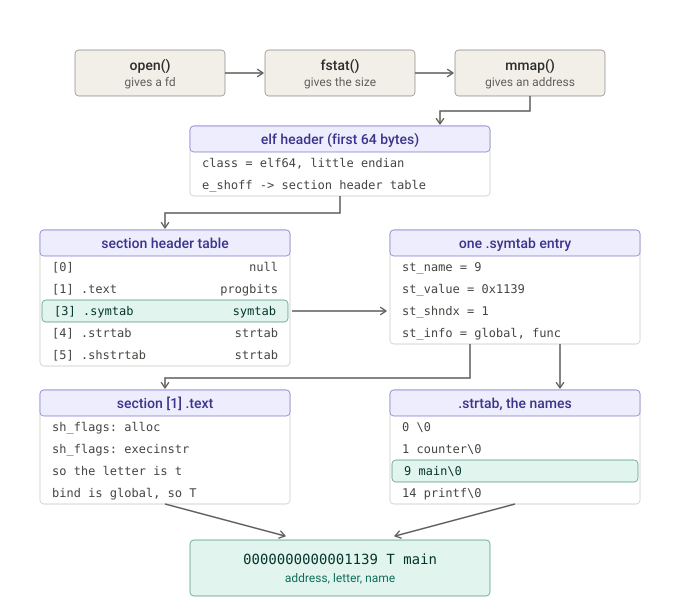

basically, ft_nm reimplementation la nm, l hyye bte5od compiled file aw executable and displays its symbols, l henne masalan
function, global variable... example:

0000000000004010 D counter

0000000000004010 → the address (where it lives in memory)
D → what it is (D = global variable in .data)
counter → its name

okay so first, we have these libraries for these functions and types:

<stdlib.h>	malloc, free
<fcntl.h>	open, O_RDONLY
<unistd.h>	write, close
<elf.h>	Elf64_Ehdr, Elf32_Shdr, Elf64_Sym, and every SHT_/SHF_/STB_/STT_/SHN_/ELFMAG macro
<errno.h>	errno, ENOENT, EACCES
<locale.h>	setlocale, LC_COLLATE
<string.h>	memcpy, strcoll
<sys/stat.h>	struct stat, fstat, S_ISDIR
<sys/mman.h>	mmap, munmap, PROT_READ, MAP_PRIVATE, MAP_FAILED

The path, told as a story

The file is just bytes. You open it and mmap it, which asks the kernel to make the whole file appear as one contiguous block of memory. Now the file is an address plus a size, and every position inside it is just a number of bytes from the start — an offset. That's the only vocabulary ELF uses: everything points to everything else by offset.

The first 64 bytes are the ELF header — the cover page. It tells you three things you can't get anywhere else: that this really is an ELF file (the magic bytes), whether it's 32-bit or 64-bit and the offset of the section header table, plus how many entries it has and how big each one is. The header is the only thing at a fixed, known place. Everything else you find by following it.

A section is a labelled chunk of the file. A compiled program isn't one section, it's cut into sections by purpose.

Among those sections are the two you're actually hunting: .symtab and .dynsym — the symbol tables. A symbol table is an array of fixed-size entries, one per named thing in the program. You find them not by their name but by their type (SHT_SYMTAB / SHT_DYNSYM), because that's what actually defines them. its nice to note that the .symtab is the only one used here since it has all teh things we need and asked for (locals, statics, functions...).

But a symbol entry doesn't contain its own name. It contains st_name, a number: an offset into yet another section, a string table (.strtab), which is nothing but names glued together end to end separated by \0. And the symbol table tells you which string table is its own through its sh_link field — the index of another section. So resolving one symbol name is a three-hop chain: symbol entry → sh_link → string table section header → the bytes at str_offset + st_name. There is a second, separate string table too, .shstrtab, which holds the section names — you need it because a "section symbol" has no name of its own and nm prints the name of the section it stands for instead. Mixing up those two string tables gives you plausible-looking but completely wrong names, which is the classic bug in this project.

Each symbol entry itself carries four useful facts: its name offset, its st_value (the address it sits at), its st_shndx (the index of the section it belongs to — or a special value meaning "undefined, defined in some other file", "absolute constant", or "common, not placed yet"), and st_info, a single byte with two fields packed into it: the binding in the high nibble (local / global / weak) and the type in the low nibble (function / object / section / file). You unpack those with the ELF_ST_BIND and ELF_ST_TYPE macros.

Then you turn all that into one letter. This is the part that looks like magic in nm's output and is actually a short decision tree. First the special cases that have no section to look at: undefined → U, common → C, absolute → a, weak → W/V (or w/v if it's also undefined). Otherwise you go look up the section the symbol lives in and ask what that section contains, not what it's called: executable → t, allocated and read-only → r, allocated and writable → d, no contents at all → b, debug info → N. And the final rule that ties it together: lowercase means local, uppercase means global — so a t becomes T if the symbol's binding is global. That's why nm output is readable at a glance: T main is your global function in .text, U printf is a call to something libc will provide.

Finally you filter, sort and print. The options decide what to hide (-u only undefined, -g only external, -a also the debugger-only entries nm normally suppresses), the sort is by name using strcoll so it follows the machine's language rather than raw byte order (which is why main starts with setlocale), and each line comes out as address, letter, name.

The one-sentence mental model

An ELF file is a book that begins with a table of contents (the section header table) telling you where every chapter is; two of those chapters are an index of names (the symbol tables), except the index stores its words as page-references into a third chapter that is nothing but text (the string tables) — and nm is the program that follows all three hops and prints the index back out in plain English.

And the sentence about why it's not trivial

Every one of those offsets, sizes, counts and indices comes out of the file itself, so a corrupted or malicious file can point them anywhere. Since the file is mmaped, reading one byte past the end isn't a warning — it's a segfault. So the real work of the project isn't parsing ELF, it's validating it: check the range is inside the mapping before every single read, check the string you're about to return actually has a \0 inside its table, check a claimed string table really is a string table, and copy multi-byte fields out with memcpy instead of casting a pointer, because the file can put a structure at an unaligned address. Get the parsing right and it works on your own binaries; get the validation right and it survives everything the evaluator throws at it.

The whole path in one picture

Reading it as a story:

Top row, getting the bytes. open gives a descriptor, fstat gives the size, mmap turns them into a plain address. From here everything is just address + offset.

The elf header. The only thing at a fixed place. It tells you the class (so you know how wide every field is) and e_shoff, where the section header table starts. Without that one field you are blind.

The section header table. You walk it entry by entry. You are not looking for a name, you are looking for a type: the row whose sh_type is SHT_SYMTAB. That row gives you the offset and the size of .symtab, and its sh_link tells you which row is its string table.

One .symtab entry. Now you are inside the symbol table. Each entry holds four things you need, and notice the name is not one of them. st_name = 9 is just a number.

Two lookups from that one entry, going in opposite directions:
  st_name = 9 -> jump into .strtab at byte 9, read until the \0 -> main
  st_shndx = 1 -> go back to the section header table, row 1, read its sh_flags -> allocated and executable -> t, and since st_info says global, uppercase it -> T

The line. st_value gives the address, the section flags gave the letter, .strtab gave the name. Three separate places in the file, joined into one line of output.

That double lookup, one forward into the strings and one backward into the sections, is the part worth saying out loud: it is why get_symbol_letter calls read_section_header again at print time, long after find_symbol_tables already finished walking those same headers.

I want the following changes:

make all the static functions non-static, so it will look like more human-written

is there is any place with a sus name or smthn related to AI usage change it, but minmal ones

